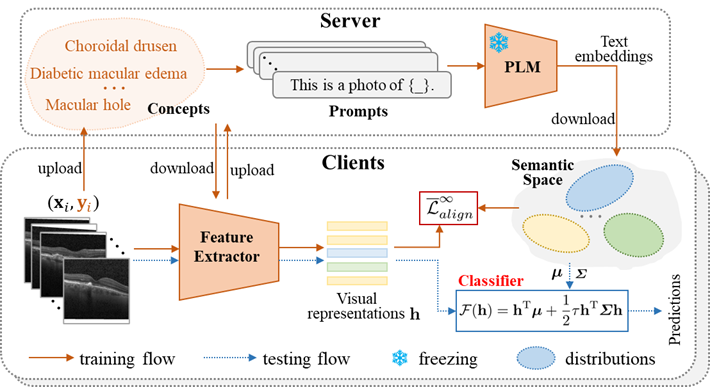

# Stealing Knowledge from Pre-trained Language Models for Federated Classifier Debiasing
This repository is an official PyTorch implementation of the paper **"Stealing Knowledge from Pre-trained Language Models for Federated Classifier Debiasing"** from MICCAI 2024 (Early Accept).

Federated learning (FL) has shown great potential in medical image computing since it provides a decentralized learning paradigm that allows multiple clients to train a model collaboratively without privacy leakage. However, current studies have shown that heterogeneous data of clients causes biased classifiers of local models during training, leading to the performance degradation of a federation system. In experiments, we surprisingly found that continuously freezing local classifiers can significantly improve the performance of the baseline FL method (FedAvg) for heterogeneous data. This observation motivates us to pre-construct a high-quality initial classifier for local models and freeze it during local training to avoid classifier biases.
With this insight, we propose a novel approach named Federated Classifier deBiasing (FedCB) to solve the classifier biases problem in heterogeneous federated learning. The core idea behind FedCB is to exploit linguistic knowledge from pre-trained language models (PLMs) to construct high-quality local classifiers. Specifically, FedCB first collects the class concepts from clients and then uses a set of prompts to contextualize them, yielding language descriptions of these concepts. These descriptions are fed into a pre-trained language model to obtain their text embeddings. The generated embeddings are sent to clients to estimate the distribution of each category in the semantic space. Regarding these distributions as the local classifiers, we perform the alignment between the image representations and the corresponding semantic distribution by minimizing an upper bound of the expected cross-entropy loss. Extensive experiments on public datasets demonstrate the superior performance of FedCB compared to state-of-the-art methods.

<div align=center>

</div>


## Running
The implementation details can be found at [FedBM](https://github.com/CUHK-AIM-Group/FedBM).

## Citation
If you find our work useful in your research or publication, please cite our work:
```
@inproceedings{2024Stealing,
  title={Stealing Knowledge from Pre-trained Language Models for Federated Classifier Debiasing},
  author={Zhu, Meilu and Yang, Qiushi and Gao, Zhifan and Liu, Jun and Yuan, Yixuan},
  booktitle={International Conference on Medical Image Computing and Computer-Assisted Intervention},
  year={2024}
}
```
